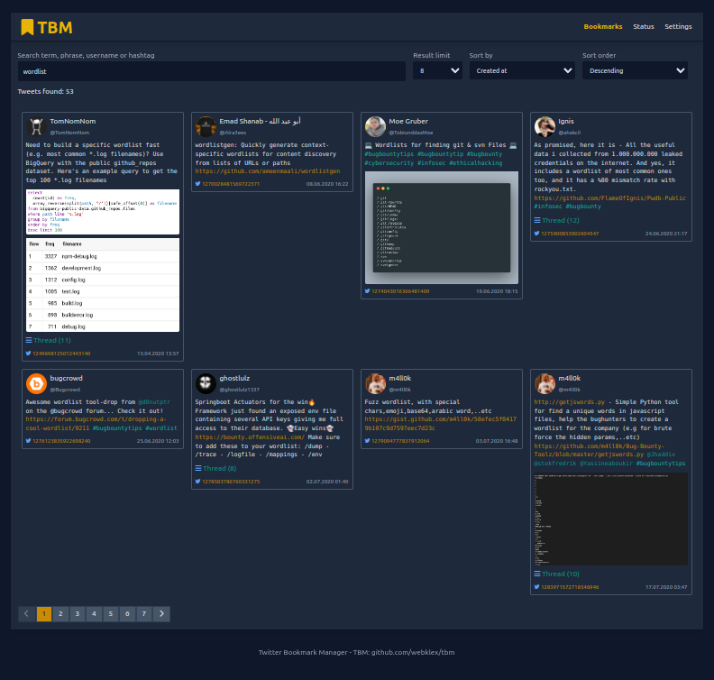

# TBM - Twitter Bookmark Manager

Fetch all your bookmarked tweets and make them accessible through a webinterface.

[![Releases][ico-release]](https://github.com/Webklex/tbm/releases)
[![Downloads][ico-downloads]](https://github.com/Webklex/tbm/releases)
[![License][ico-license]](LICENSE.md)
[![Hits][ico-hits]][link-hits]


(Search for bookmarked tweets)

## Table of Contents
- [Features](#features)
- [Installation](#installation)
- [Usage](#usage)
- [Configuration](#configuration)
- [Api](#websocket-commands)
- [Build](#build)
- [Support](#support)
- [Security](#security)
- [License](#license)

## Features
- Fetch all bookmarked tweets
- Search for all bookmarked tweets containing a given phrase (this includes: username, real name, hashtag, tweet content and real urls)

## Installation
You can either download a matching prebuild binary and config from the [releases](https://github.com/Webklex/tbm/releases)
or clone this repository and [build](#build) it yourself.

## Usage
In order to fetch your bookmarks, you'll have to supply an active access token with a matching cookie. 
You can get both by the following steps:
1. Login to twitter.com and press `f12`, switch to the `Network` tab
2. Go to https://twitter.com/i/bookmarks and look for a request named `Bookmarks?variables=%7B%22count%22%3A20..` inside your open network tab
3. Click on the request and switch to the `Headers` tab if it isn't selected and scroll down to `Request Headers`
4. Copy the line starting with `cookie: ` and `authorization: Bearer `. Make sure to enclose the entire cookie string in quotes (`"`). Escape possible quotes on key:values pairs inside the cookie as `\"`.
5. (optional - might not be necessary) Check if the `section` has changed (part of the url in front of `Bookmarks?variables=%7B%22count%22%3A20..`), if so copy it as well
6. (optional - might not be necessary) To retrieve a valid `section` to remove a bookmark, keep the network tab open and remove a dummy bookmark. Look for a `DeleteBookmark` request and copy its `section` part to `sections.remove` or use it as `-remove-section` argument value.

```bash
  -config string
        Application config file (default "./config.json")
  -offline
        Don't fetch new bookmarks; link to local files only
  -access-token string
        Twitter bearer access token
  -cookie string
        Twitter cookie string
  -data-dir string
        Folder containing all fetched data (default "./data")
  -delay duration
        Delay your request by a given time (default 30s)
  -host string
        Host address the api should bind to (default "localhost")
  -port uint
        Port the api should bind to (default 4788)
  -remove-section string
        Twitter remove bookmark api section name (default "Wlmlj2-xzyS1GN3a6cj-mQ")
  -index-section string
        Twitter bookmark api section name (default "BvX-1Exs_MDBeKAedv2T_w")
  -timeout duration
        Request timeout (default 10s)
  -timezone string
        Application time zone (default "UTC")
  -danger-remove-bookmarks
        Remove the bookmark on Twitter if the tweet has been downloaded
  -log int
        Set the log mode (0 = all, 1 = success, 2 = warning, 3 = statistic, 4 = error)
  -no-color
        Disable color output
  -version
        Show version and exit
  -help
        Show help and exit
```

## Configuration
Besides the command arguments, you can also provide a config file:
```json
{
  "timezone": "UTC",
  "data_dir": "./data",
  "mode": "online",
  "danger": {
    "remove_bookmarks": false
  },
  "server": {
    "host": "localhost",
    "port": 4788
  },
  "scraper": {
    "sections": {
      "index": "BvX-1Exs_MDBeKAedv2T_w",
      "remove": "Wlmlj2-xzyS1GN3a6cj-mQ"
    },
    "delay": "30s",
    "cookie": "guest_id=...",
    "access_token": "AAAAA..."
  }
}
```

### Modes
There are currently two different modes available. `online` and `offline`. If you enable 
`offline` mode, the program won't fetch any new bookmarks and only reference previously downloaded
resources such as tweets and media files.

## Websocket commands
The websocket can be accessed under `ws://{host}:{port}/ws`.

Get all tweets:
```json
{
  "command":"get_tweets",
  "payload":{}
}
```
Search for tweets containing the search query:
```json
{
  "command":"search_tweets",
  "payload":{
    "query": "foo bar"
  }
}
```

## Custom Styles
By default all assets (.js, .css, .html, etc) get included while building a new version.

### Structure:
- static
  - assets
    - css
      - tailwind.css
  - template
  - css
    - tailwind.css (compiled tailwind css)
    - style.css (custom styling)
  - js
    - app.js
  - index.html

## Development
Requirements:
- `Node` v12.13
- `Golang` ^1.17.2

```bash
npm run watch
npm run build
go run main.go
```

## Build
Build a new regular binary:
```bash
go build -ldflags "-w -s -X main.buildNumber=1 -X main.buildVersion=custom" -o tbm
```


### Features & pull requests
Everyone can contribute to this project. Every pull request will be considered, but it can also happen to be declined.
To prevent unnecessary work, please consider to create a [feature issue](https://github.com/webklex/tbm/issues/new?template=feature_request.md)
first, if you're planning to do bigger changes. Of course, you can also create a new [feature issue](https://github.com/webklex/tbm/issues/new?template=feature_request.md)
if you're just wishing a feature ;)

>Off-topic, rude or abusive issues will be deleted without any notice.


## Support
If you encounter any problems or if you find a bug, please don't hesitate to create a new [issue](https://github.com/webklex/tbm/issues).
However, please be aware that it might take some time to get an answer.

If you need **immediate** or **commercial** support, feel free to send me a mail at github@webklex.com.

## Change log

Please see [CHANGELOG](CHANGELOG.md) for more information what has changed recently.

## Security

If you discover any security related issues, please email github@webklex.com instead of using the issue tracker.

## Credits
- [Webklex][link-author]
- [All Contributors][link-contributors]

## License
The MIT License (MIT). Please see [License File](LICENSE.md) for more information.

[ico-license]: https://img.shields.io/badge/license-MIT-brightgreen.svg?style=flat-square
[ico-release]: https://img.shields.io/github/v/release/webklex/tbm?style=flat-square
[ico-downloads]: https://img.shields.io/github/downloads/webklex/tbm/total?style=flat-square
[ico-hits]: https://hits.webklex.com/svg/webklex/tbm?1

[link-hits]: https://hits.webklex.com
[link-author]: https://github.com/webklex
[link-contributors]: https://github.com/webklex/tbm/graphs/contributors
